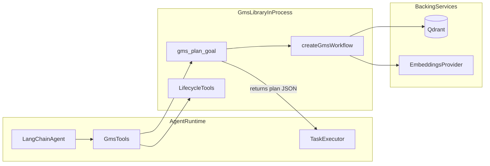

# Vector-centric Goal Management System built with LangChain TypeScript and LangGraph (GMS)

[](https://www.npmjs.com/package/@farukada/langchain-ts-gms)
[](https://github.com/sponsors/FarukAda)


GMS is a planning library for autonomous agents. It turns a goal into a hierarchical task graph (tasks + sub-tasks + dependencies), while your external agent remains responsible for execution.

## Table of Contents

- [What This Package Is](#what-this-package-is)
- [Responsibility Boundary](#responsibility-boundary)
- [System Overview](#system-overview)
- [Quick Start](#quick-start)
- [Use as Library](#use-as-library)
- [Public API Reference](#public-api-reference)
- [Package Exports](#package-exports)
- [Tool Catalog](#tool-catalog)
- [Configuration Reference](#configuration-reference)
- [Production Considerations](#production-considerations)
- [Known Non-Goals](#known-non-goals)
- [Testing and CI](#testing-and-ci)
- [Documentation](#documentation)
- [Project Structure](#project-structure)
- [License](#license)

<a id="what-this-package-is"></a>

## What This Package Is

- **Planning-only engine**: builds plans and validates goal trees.
- **Hierarchical model**: goal -> tasks -> sub-tasks with parent and dependency links.
- **LangChain-native**: exports tools via the `tool()` factory from `@langchain/core/tools`.
- **Vector-centric**: uses embeddings + Qdrant for semantic decomposition and retrieval.

<a id="responsibility-boundary"></a>

## Responsibility Boundary

| Concern                                       | Owned by GMS | Owned by your Agent |
| --------------------------------------------- | ------------ | ------------------- |
| Goal decomposition into tasks/sub-tasks       | Yes          | No                  |
| Task dependency-safe ordering                 | Yes          | No                  |
| Goal/task retrieval and mutation tooling      | Yes          | No                  |
| Task execution (calling APIs, tools, scripts) | No           | Yes                 |
| Runtime retries, side effects, actuation      | No           | Yes                 |

<a id="system-overview"></a>

## System Overview



<a id="quick-start"></a>

## Quick Start

### Prerequisites

- Node.js >= 22
- npm
- Docker (for Qdrant)

### Install

```bash
npm add @farukada/langchain-ts-gms
```

### Development infrastructure

```bash
# Start Qdrant (vector storage) and Ollama (LLM + embeddings)
docker compose up -d qdrant
docker compose --profile ollama up -d ollama
```

Full operational steps and troubleshooting are in [docs/operations.md](./docs/operations.md).

<a id="use-as-library"></a>

## Use as Library

Install:

```bash
npm add @farukada/langchain-ts-gms
```

### Minimal registration

```ts
import { createGmsToolFromEnv } from "@farukada/langchain-ts-gms/tool";

const planTool = await createGmsToolFromEnv();
agent.tools.push(planTool);
```

### Full lifecycle registration

```ts
import {
  createGmsToolFromEnv,
  createGmsLifecycleToolsFromEnv,
} from "@farukada/langchain-ts-gms/tool";

const planTool = await createGmsToolFromEnv({
  decomposeOptions: { topK: 5, maxDepth: 4 },
});
const lifecycleTools = await createGmsLifecycleToolsFromEnv();

agent.tools.push(planTool, ...lifecycleTools);
```

#### `decomposeOptions`

| Option     | Default | Purpose                                                                                 |
| ---------- | ------- | --------------------------------------------------------------------------------------- |
| `topK`     | `5`     | Number of capability vectors retrieved from Qdrant as context for the LLM decomposition |
| `maxDepth` | `4`     | Maximum nesting depth for the hierarchical task tree                                    |

Higher `topK` gives the planner more context but increases token cost. Lower `maxDepth` produces flatter plans.

### Multi-tenancy

All tools support an optional `tenantId` field for data isolation. When set, capability search and goal listing are scoped to the given tenant:

```ts
const planTool = await createGmsToolFromEnv();
// The agent passes tenantId when invoking the tool:
// { goalDescription: "...", tenantId: "org-123" }
```

Qdrant payload indexes on `metadata.tenant_id` ensure filtered queries remain fast.

<a id="public-api-reference"></a>

## Public API Reference

### Main exports

- `createGmsPlanTool(deps)`: create planning tool (`gms_plan_goal`).
- `createGmsToolFromEnv(options)`: env-based planning tool factory.
- `createGmsLifecycleTools(deps)`: create retrieval/mutation/validation toolset.
- `createGmsLifecycleToolsFromEnv(options)`: env-based lifecycle factory.
- `createAllGmsToolsFromEnv(options)`: convenience factory for both planning + lifecycle tools with shared repository instances (recommended).
- `createPlan(input, deps)`: execute planning directly without tool wrapper.
- `streamPlan(input, deps)`: async generator that streams `GmsEvent` objects as the workflow progresses (planner → guardrail → summarizer).
- `decomposeGoal(goal, repo, embeddings, chatModel, options?)`: lower-level LLM-powered task decomposition (used internally by the planner).
- `patchPlanSubtree(repository, options)`: surgically replace a sub-tree of the task DAG without touching the rest of the plan.
- `createGmsWorkflow(deps)`: lower-level LangGraph workflow factory.

### Rate limiting

- `TokenBucketLimiter`: in-process token-bucket rate limiter. Pass as `GmsToolDeps.rateLimiter` to throttle tool invocations.
- `RateLimitError`: thrown when `TokenBucketLimiter.acquire()` times out.

### Key result shape (`gms_plan_goal`)

```ts
{
  version: "1.0",
  goalId: string,
  status: "planned" | "failed" | "human_approval_required",
  tasks: Task[],
  executionOrder: string[],
  traceId?: string,
  interrupt?: unknown,
  error?: string
}
```

### Advanced dependency wiring (explicit repositories)

```ts
import {
  createGmsPlanTool,
  QdrantGoalRepository,
  createEmbeddingProvider,
  CAPABILITIES_COLLECTION,
} from "@farukada/langchain-ts-gms";

const embeddings = createEmbeddingProvider();
const goalRepository = new QdrantGoalRepository({ embeddings });
const capabilityRepository = new QdrantGoalRepository({
  embeddings,
  collectionName: CAPABILITIES_COLLECTION,
});
await goalRepository.bootstrap();

const planTool = createGmsPlanTool({ goalRepository, capabilityRepository });
agent.tools.push(planTool);
```

### Production checkpointer

By default, the GMS workflow uses an **in-memory checkpointer** (`MemorySaver`) — state is lost on process restart. For production, inject a persistent checkpointer via `createGmsWorkflow`:

```ts
import { SqliteSaver } from "@langchain/langgraph-checkpoint-sqlite";
import {
  createGmsWorkflow,
  QdrantGoalRepository,
  createEmbeddingProvider,
} from "@farukada/langchain-ts-gms";

const checkpointer = SqliteSaver.fromConnString("./gms.db");
const embeddings = createEmbeddingProvider();
const goalRepository = new QdrantGoalRepository({ embeddings });

const workflow = createGmsWorkflow({
  goalRepository,
  checkpointer, // persists workflow state across restarts
});
```

The `checkpointer` option is accepted by `createGmsWorkflow` (via the `WorkflowDeps` interface). The higher-level `createGmsPlanTool` and `*FromEnv` factories use `MemorySaver` internally; to override it, use `createGmsWorkflow` directly.

### Human-in-the-Loop (HITL)

When a plan exceeds the guardrail task-count threshold (default: 50 tasks) or contains a task with `riskLevel: "critical"`, the workflow triggers a LangGraph `interrupt` and returns `status: "human_approval_required"`:

```ts
const result = JSON.parse(await planTool.invoke({ goalDescription: "..." }));

if (result.status === "human_approval_required") {
  // result.interrupt contains: { action, goalId, taskCount, message }
  // Present the plan to a human for review, then resume the workflow
  // using the thread_id (result.goalId) via the compiled workflow.
}
```

The interrupt payload shape:

```ts
{ action: "approve_plan", goalId: string, taskCount: number, message: string }
```

### Capability seeding

The planner searches the `gms_capabilities` Qdrant collection for existing capabilities to inform task decomposition. Without seeded capabilities, the LLM decomposes blindly — plans still work but are lower quality.

Seed capabilities using the same `GoalMemoryRepository`:

```ts
import {
  QdrantGoalRepository,
  createEmbeddingProvider,
  CAPABILITIES_COLLECTION,
} from "@farukada/langchain-ts-gms";

const embeddings = createEmbeddingProvider();
const capRepo = new QdrantGoalRepository({
  embeddings,
  collectionName: CAPABILITIES_COLLECTION,
});
await capRepo.bootstrap();

await capRepo.upsert({
  id: crypto.randomUUID(),
  description: "Deploy Node.js services to Kubernetes",
  status: "planned",
  priority: "medium",
  tasks: [],
  createdAt: new Date().toISOString(),
  updatedAt: new Date().toISOString(),
});
```

The more relevant capabilities you seed, the better the planner's task decomposition quality.

<a id="package-exports"></a>

## Package Exports

The package exposes granular sub-path exports for tree-shaking and targeted imports:

| Sub-path                                       | Provides                                                      |
| ---------------------------------------------- | ------------------------------------------------------------- |
| `@farukada/langchain-ts-gms`                   | All public APIs (tools, repos, domain utils, schemas)         |
| `@farukada/langchain-ts-gms/tool`              | `createGmsPlanTool`, `createGmsLifecycleTools`, env factories |
| `@farukada/langchain-ts-gms/tools/*`           | Individual tool factories (`planGoal`, `getGoal`, etc.)       |
| `@farukada/langchain-ts-gms/helpers`           | Input normalization, pagination, tree filtering               |
| `@farukada/langchain-ts-gms/types`             | `GmsToolDeps`, `GmsPlanResult`, `AllGmsTools`                 |
| `@farukada/langchain-ts-gms/schemas/planning`  | `GmsToolInputSchema`                                          |
| `@farukada/langchain-ts-gms/schemas/lifecycle` | All lifecycle tool input schemas                              |
| `@farukada/langchain-ts-gms/mcp`               | `createGmsMcpServer`, `startMcpServer`, `GmsMcpServerOptions` |

### Example: import individual tools

```ts
import { createGetGoalTool } from "@farukada/langchain-ts-gms/tools/getGoal";
import { createUpdateTaskTool } from "@farukada/langchain-ts-gms/tools/updateTask";
```

<a id="tool-catalog"></a>

## Tool Catalog

### Planning tool

- `gms_plan_goal`: create a hierarchical plan and dependency-safe `executionOrder`.

### Lifecycle tools

- `gms_get_goal`: fetch goal with full hierarchical tasks.
- `gms_get_task`: fetch a single task by `goalId` + `taskId`.
- `gms_list_tasks`: list tasks with filters and pagination.
- `gms_search_tasks`: search tasks by text, status, priority, dependency presence.
- `gms_list_goals`: list goals with filters and pagination.
- `gms_update_goal`: update goal fields.
- `gms_update_task`: update task status/result/error.
- `gms_validate_goal_tree`: validate hierarchy and dependency invariants.
- `gms_get_progress`: get progress counters and completion rate.
- `gms_replan_goal`: replan using `append`, `replace_failed`, or `replace_all`.
- `gms_expand_task`: dynamically expand a parent task into sub-tasks at runtime (map-reduce / fan-out).

### Tool input/output reference

| Tool                     | Required input               | Output focus                                               |
| ------------------------ | ---------------------------- | ---------------------------------------------------------- |
| `gms_plan_goal`          | `goalDescription`            | `goalId`, `status`, hierarchical `tasks`, `executionOrder` |
| `gms_get_goal`           | `goalId`                     | Full goal object with nested tasks                         |
| `gms_get_task`           | `goalId`, `taskId`           | Single task + `parentId` + dependency context              |
| `gms_list_tasks`         | `goalId`                     | Filtered/paginated task list + `total`                     |
| `gms_search_tasks`       | `goalId`                     | Query/filter-based paginated task results                  |
| `gms_list_goals`         | none                         | Filtered/paginated goals + `total`                         |
| `gms_update_goal`        | `goalId`                     | Updated goal status/metadata fields                        |
| `gms_update_task`        | `goalId`, `taskId`           | Updated task snapshot                                      |
| `gms_validate_goal_tree` | `goalId`                     | Invariant validation result (`valid`, `issues`)            |
| `gms_get_progress`       | `goalId`                     | Counters + completion rate                                 |
| `gms_replan_goal`        | `goalId`                     | Replan diff (`replacedTaskIds`, `newTaskIds`)              |
| `gms_expand_task`        | `goalId`, `parentTaskId`, `subTasks` | Expanded task with new sub-tasks attached            |

<a id="configuration-reference"></a>

## Configuration Reference

Runtime environment variables:

| Variable                     | Required | Default                                | Purpose                                              |
| ---------------------------- | -------- | -------------------------------------- | ---------------------------------------------------- |
| `NODE_ENV`                   | No       | `development`                          | Runtime mode                                         |
| `LOG_LEVEL`                  | No       | `info`                                 | Minimum log level (`debug`, `info`, `warn`, `error`) |
| `QDRANT_URL`                 | No       | `http://localhost:6333`                | Qdrant endpoint                                      |
| `QDRANT_API_KEY`             | No       | -                                      | Qdrant authentication key                            |
| `OLLAMA_HOST`                | No       | `http://localhost:11434`               | Ollama server URL                                    |
| `OLLAMA_EMBEDDING_MODEL`     | No       | `nomic-embed-text`                     | Default embedding model                              |
| `OLLAMA_CHAT_MODEL`          | No       | `qwen3:8b`                             | Default chat/planning model                          |
| `GMS_OLLAMA_EMBEDDING_MODEL` | No       | falls back to `OLLAMA_EMBEDDING_MODEL` | GMS-specific embedding model override                |
| `GMS_OLLAMA_CHAT_MODEL`      | No       | falls back to `OLLAMA_CHAT_MODEL`      | GMS-specific chat model override                     |
| `LANGCHAIN_TRACING_V2`       | No       | `false`                                | LangChain tracing toggle                             |
| `LANGCHAIN_API_KEY`          | No       | -                                      | LangSmith API key when tracing is enabled            |

<a id="production-considerations"></a>

## Production Considerations

- **Checkpointer**: Replace the default in-memory `MemorySaver` with a persistent store. See [Production checkpointer](#production-checkpointer).
- **Capabilities**: Seed the `gms_capabilities` collection for higher-quality plans. See [Capability seeding](#capability-seeding).
- **HITL**: Handle the `human_approval_required` status if plans exceed guardrail thresholds. See [Human-in-the-Loop](#human-in-the-loop-hitl).
- **Multi-tenancy**: Pass `tenantId` to isolate data per organization. See [Multi-tenancy](#multi-tenancy).

<a id="known-non-goals"></a>

## Known Non-Goals

- GMS does not execute tasks; it only plans and manages goal/task state.
- GMS does not lock/claim tasks for concurrent workers in this package version.
- GMS does not include audit history/event sourcing for every lifecycle mutation.
- GMS does not enforce organization-specific policy packs out of the box; guardrails are extensible.

<a id="testing-and-ci"></a>

## Testing and CI

### Local checks

| Command                 | Purpose                                |
| ----------------------- | -------------------------------------- |
| `npm test`              | Unit tests (CI-safe, no external deps) |
| `npm run test:ci`       | CI-safe unit test suite                |
| `npm run test:watch`    | Watch mode for development             |
| `npm run test:coverage` | Unit tests with V8 coverage            |

### CI pipeline


<a id="documentation"></a>

## Documentation

- [Documentation Index](./docs/README.md)
- [Architecture](./docs/architecture.md)
- [Operations Runbook](./docs/operations.md)
- [ADR 0001: Vector-Centric GMS](./docs/adr/0001-vector-centric-gms.md)

<a id="project-structure"></a>

## Project Structure

```text
src/
├── app/          # Workflow, planning, guardrails
├── lib/          # Public library API + tools
├── config/       # Environment configuration
├── domain/       # Core contracts and task utilities
└── infra/        # Qdrant, embeddings, observability
```

<a id="license"></a>

## License

MIT
