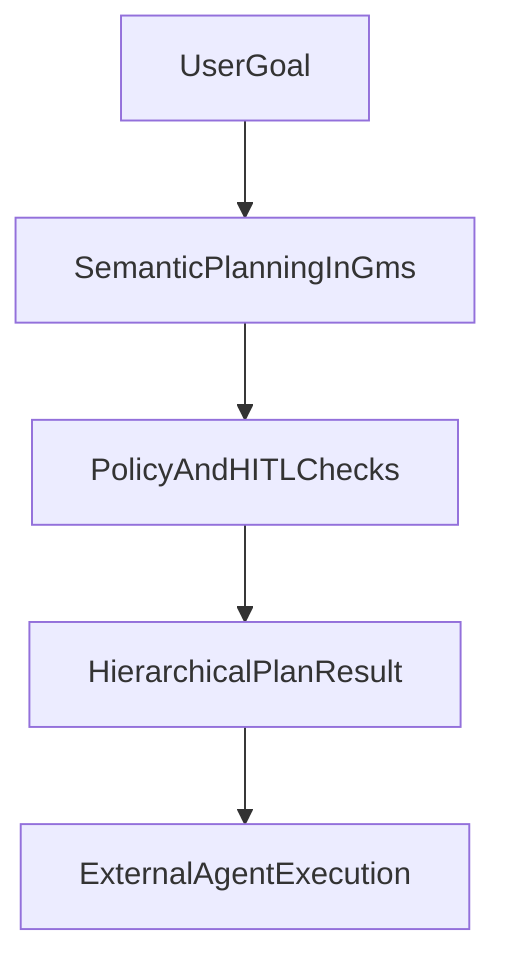

# ADR 0001: Vector-Centric Goal Management Architecture

## Status

Accepted

## Context

Early AI applications were stateless; each interaction was isolated. Modern goal-oriented agents require persistent cognitive state and semantic reasoning over progress, priorities, and plan adjustments. Traditional rule-based systems fail to handle natural language ambiguity.

## Decision

Adopt a vector-centric architecture where:

1. **Goals and capabilities** are stored as embeddings in Qdrant
2. **LangGraph** orchestrates the planning loop and policy guardrails
3. **Semantic decomposition** uses Versioned Capability Vectors (VCVs) for task assignment
4. **Payload filtering** enables strict business rules (status, tenant, priority) alongside similarity search
5. **GMS remains planning-only**; external agents execute tasks

Decision model:

Implementation shape:

- Package exports a library-first API and LangChain tools for in-process use.
- The planning tool returns structured plans with hierarchical tasks and dependency-safe ordering.
- Lifecycle tools cover retrieval, mutation, validation, progress, and replanning.

## Consequences

### Positive

- Semantic matching handles intent ambiguity better than keyword rules
- Filterable HNSW preserves recall under heavy filtering
- Cyclic graphs enable self-correction on failure
- Clear separation between planning (expensive model) and execution (lighter model)
- Lifecycle tools allow complete goal management without overloading core planning logic

### Negative

- Vector DB operational overhead vs. relational-only
- Embedding latency adds to planning time
- Requires disciplined schema design for payload indexes
- Additional testing effort is required to validate both fast and heavy CI paths

## Alternatives Considered

- **Relational + full-text**: Insufficient for semantic decomposition
- **Generic vector extensions (e.g. pgvector)**: Lower latency guarantees at scale
- **Stateless chains**: No recovery from partial failure

## Validation Notes

The decision is validated through:

- Unit + integration test suites
- Agent-facing integration test (LangChain tool-calling)
- Quality rubric and golden scenario tests
- CI pipeline (`npm run test:ci`) and agent integration suite (`npm run test:agent`)
