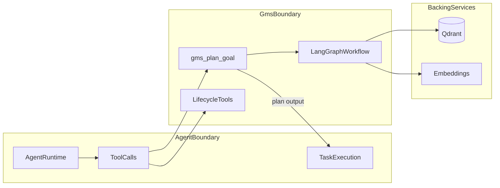
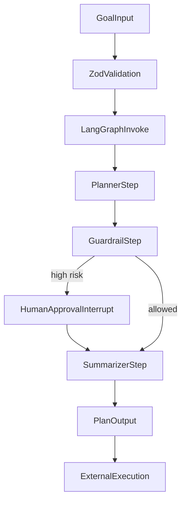
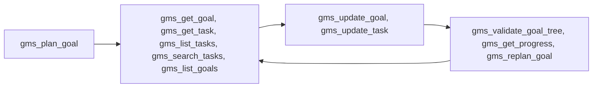

# Vector-Centric GMS Architecture

## Overview

The Goal Management System (GMS) is a vector-centric architecture for planning complex work for autonomous agents. Goals, hierarchical tasks, and capabilities are embedded and stored in Qdrant, enabling recursive similarity-based decomposition and filtered retrieval.

## Scope Boundary

> **⚠️ Planning Library Only** — GMS decomposes goals into hierarchical task plans and validates them. It does **not** execute tasks. Your agent runtime is responsible for task execution using the plan produced by GMS.

- GMS **plans** work and validates goal trees.
- External agents **execute** tasks.
- This package does not embed task execution logic in its core planning workflow.

## Core Components

### 1. LangGraph Orchestrator

The workflow produces plans for autonomous agents to execute:

- **Planner**: Decomposes high-level goals using capability vector search
- **Guardrail**: Policy checks; HITL interrupt for high-risk plans
- **Summarizer**: Outputs plan (goal status `planned`, tasks `pending`) for the agent

### 2. Qdrant as Vector Backbone

- **Collections**: `goals`, `capabilities` (Versioned Capability Vectors)
- **Filterable HNSW**: Semantic search with strict payload filters (status, priority, tenant)
- **Payload indexing**: Enables fast metadata filtering for workflow updates

### 3. Recursive Semantic Task Decomposition

1. **Goal embedding**: User goal → vector
2. **Capability scoring**: Similarity against VCV database
3. **Top-K selection**: Most compatible agents/tools
4. **Hierarchical DAG**: Goal → Tasks → Sub-tasks (recursive until atomic or max depth)
5. **Decomposition criteria**: Continue decomposing when score < threshold or description length > limit
6. **Parent-child links**: `parentId` for subtree retrieval and execution ordering

### 4. Goal Lifecycle Tooling

The library exposes one planning tool and a full lifecycle toolset for agent-side operations:

- Plan: `gms_plan_goal`
- Retrieval: `gms_get_goal`, `gms_list_goals`, `gms_get_task`, `gms_list_tasks`, `gms_search_tasks`
- Mutation: `gms_update_goal`, `gms_update_task`
- Control: `gms_validate_goal_tree`, `gms_get_progress`, `gms_replan_goal`

This enables end-to-end goal management without moving execution logic into GMS.

## Data Flow

## Lifecycle Tool Map

## Domain Invariants

GMS enforces the following invariants for consistency and safety:

- Parent-child consistency for nested tasks.
- Dependency acyclicity and dependency reference validity.
- Task status transition rules via `canTransitionTaskStatus`.
- Goal tree structural checks via `validateGoalInvariants`.

These rules are applied by lifecycle tools such as `gms_update_task` and `gms_validate_goal_tree`.

## Quality Guarantees

- **Type safety**: Strict TypeScript, Zod runtime validation
- **Response contracts**: Versioned tool outputs for compatibility (`version` field)
- **Observability**: Structured logging, trace correlation, node timing instrumentation
- **Governance**: Policy guardrails, human-in-the-loop interrupts

### Guardrail Composite

`evaluateGuardrails(tasks, guardOpts?, approvalOpts?)` runs both `checkGuardrail` and `requiresHumanApproval` in a single pass over the flattened task tree. Returns `{ check, needsHumanApproval, flatCount }`. Exported from the public API.

## Environment Configuration

`config/env.ts` loads and validates environment variables using Zod schemas. Configuration is cached on first load, with `resetEnv()` available for test isolation. Supported providers:

- **Ollama**: `OLLAMA_HOST` for model inference (with optional `GMS_OLLAMA_*` overrides)
- **Qdrant**: `QDRANT_URL` and optional `QDRANT_API_KEY`
- **Tracing**: `LANGCHAIN_TRACING_V2` and `LANGCHAIN_API_KEY` for LangSmith

## Observability

`infra/observability/tracing.ts` provides structured logging and timing instrumentation:

- **Log levels**: `logInfo`, `logWarn`, `logError`, `logDebug` — structured JSON with `level`, `msg`, and ISO timestamp
- **Timing**: `withNodeTiming(name, fn)` wraps async operations with duration measurement
- **Trace correlation**: log entries include optional `traceId` for request tracing

- **Unit tests**: Domain invariants, task utilities, tool contract behavior.
- **Integration tests**: API + repository interactions and workflow behavior.
- **Agent integration test**: Real LangChain agent calling tools (CI-only).
- **Quality tests**: Golden scenarios and plan quality rubric checks.
