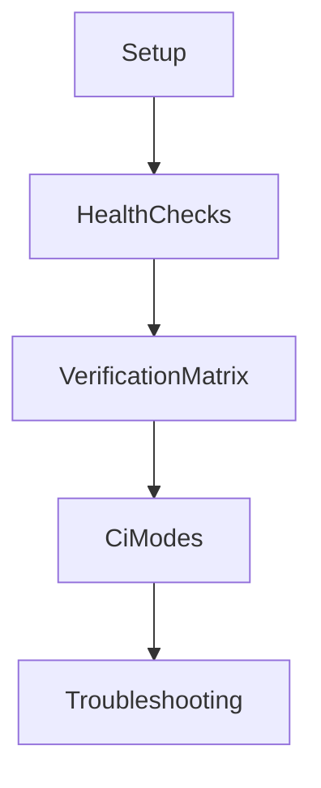
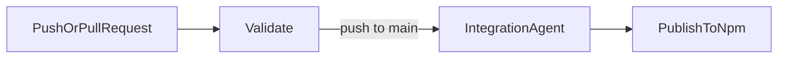

# GMS Operations Runbook

## Purpose

This runbook explains how to run, verify, and troubleshoot the GMS package in local and CI environments.

## Runbook Map



## Local Development

### Prerequisites

- Node.js >= 22
- npm
- Docker (for Qdrant)

### Quick Start

```bash
# 1. Install dependencies
npm install

# 2. Configure environment
cp .env.example .env

# 3. Start Qdrant and Ollama
docker compose up -d qdrant
docker compose --profile ollama up -d ollama
```

### Minimal Environment Variables

- `QDRANT_URL` (default: `http://localhost:6333`)
- `OLLAMA_HOST` (default: `http://localhost:11434`)

### Full Environment Reference

| Variable                     | Required | Default                                | Notes                                  |
| ---------------------------- | -------- | -------------------------------------- | -------------------------------------- |
| `NODE_ENV`                   | No       | `development`                          | `development`, `test`, or `production` |
| `LOG_LEVEL`                  | No       | `info`                                 | `debug`, `info`, `warn`, or `error`    |
| `QDRANT_URL`                 | No       | `http://localhost:6333`                | Qdrant endpoint                        |
| `QDRANT_API_KEY`             | No       | -                                      | Needed when Qdrant auth is enabled     |
| `OLLAMA_HOST`                | No       | `http://localhost:11434`               | Ollama server URL                      |
| `OLLAMA_EMBEDDING_MODEL`     | No       | `nomic-embed-text`                     | Default embedding model                |
| `OLLAMA_CHAT_MODEL`          | No       | `llama3.2:3b`                          | Default chat model                     |
| `GMS_OLLAMA_EMBEDDING_MODEL` | No       | falls back to `OLLAMA_EMBEDDING_MODEL` | GMS-specific embedding override        |
| `GMS_OLLAMA_CHAT_MODEL`      | No       | falls back to `OLLAMA_CHAT_MODEL`      | GMS-specific chat model override       |
| `LANGCHAIN_TRACING_V2`       | No       | `false`                                | Set to `true` to enable tracing        |
| `LANGCHAIN_API_KEY`          | No       | -                                      | Needed with LangSmith tracing          |

## Qdrant Collection Schema

GMS uses two Qdrant collections, auto-created on bootstrap:

| Collection         | Purpose                                                 |
| ------------------ | ------------------------------------------------------- |
| `gms_goals`        | Stores goal embeddings and hierarchical task data       |
| `gms_capabilities` | Stores capability embeddings for semantic task matching |

**Vector configuration:** Cosine distance, vector size determined by the configured embedding model (e.g., 384 for `nomic-embed-text`).

**Payload indices** (keyword, created automatically):

| Index Field               | Purpose                             |
| ------------------------- | ----------------------------------- |
| `metadata.status`         | Filter goals/capabilities by status |
| `metadata.priority`       | Filter by priority level            |
| `metadata.tenant_id`      | Multi-tenancy isolation             |
| `metadata.goal_id`        | Link tasks to parent goal           |
| `metadata.parent_goal_id` | Sub-goal hierarchy                  |

## Verification Matrix

- **Unit tests** (no external deps): `npm run test:ci`
- **All tests**: `npm test`
- **Watch mode**: `npm run test:watch`
- **Coverage**: `npm run test:coverage`
- **Agent integration** (requires Qdrant + Ollama): `npm run test:agent`

### Functional Coverage Checklist

Use this checklist before release to confirm end-to-end utility:

- [ ] Goal planning (`gms_plan_goal`) returns hierarchical tasks + execution order
- [ ] Retrieval tools return expected entities (`gms_get_goal`, `gms_get_task`, `gms_list_tasks`, `gms_search_tasks`, `gms_list_goals`)
- [ ] Mutation tools persist expected updates (`gms_update_goal`, `gms_update_task`)
- [ ] Control tools validate and track progress (`gms_validate_goal_tree`, `gms_get_progress`, `gms_replan_goal`)
- [ ] Unit, integration, and quality suites pass
- [ ] Agent integration test passes in real tool-calling mode

### CI Workflow View



### Running Tests Locally

```bash
docker compose up -d qdrant
npm test
```

## GitHub Actions Pipeline

All stages live in a single `ci.yml` workflow:

- **Stage 1 — Validate** (all pushes + PRs): `typecheck`, `lint`, `format:check`, `build`, `test:ci`, `npm audit`.
- **Stage 2 — Integration Agent** (main only, after validate): boots Qdrant + Ollama, runs `test:agent`.
- **Stage 3 — Publish** (main only, after integration): builds and publishes to npm with provenance.

Notes:

- Integration stage duration depends on Ollama model pull time and can be much slower than validation.
- Integration stage has startup health checks, retries, and failure log dumps for diagnosability.
- Publish reads the version directly from `package.json`.

## Troubleshooting

Common issues and fixes:

- **Qdrant unreachable**: verify container is running and `QDRANT_URL` matches the mapped port.
- **Agent test skipped/failing**: verify Ollama process is healthy and required models are present.
- **Empty or low-quality plans**: check capability collection content in Qdrant.

## Documentation Hygiene Checklist

- Keep examples copy-pasteable and environment-aware.
- Keep tool names and statuses consistent with `src/lib/gmsTool.ts`.
- Keep architecture boundaries aligned with `docs/architecture.md`.
- Update this runbook when scripts or workflow names change.

## Related Documentation

- [Architecture](architecture.md)
- [ADR 0001](adr/0001-vector-centric-gms.md)
